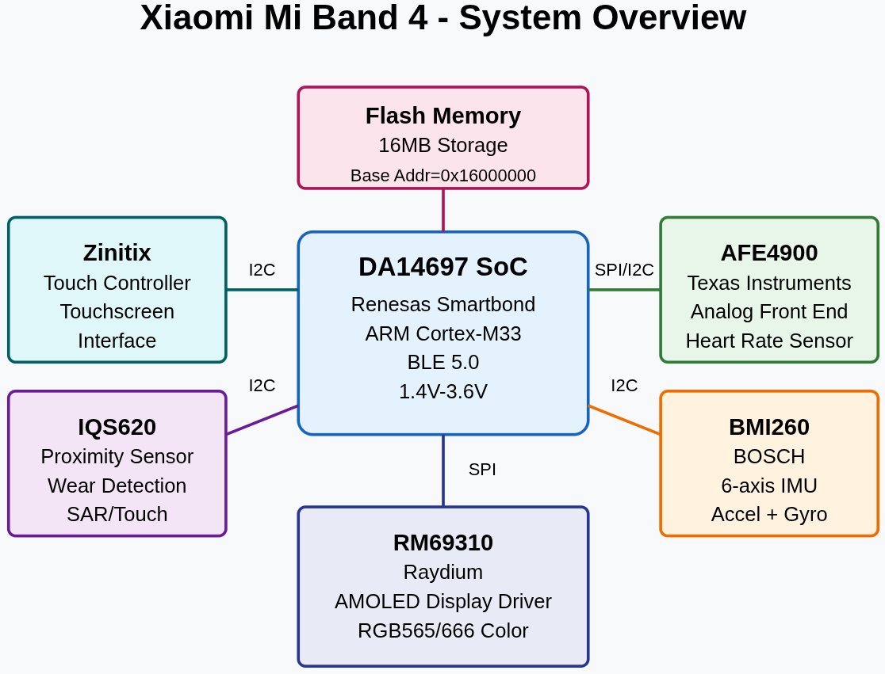
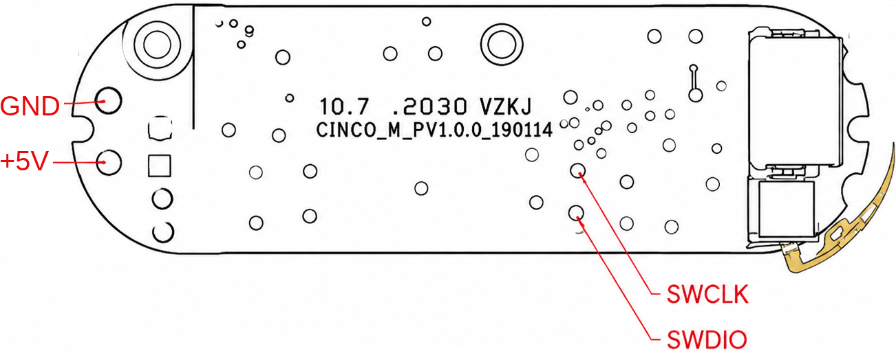

.. zephyr:board:: mi_band_4

Overview
********

The Xiaomi Mi Band 4 is a fitness tracker built around the Renesas SmartBond
DA14697 SoC, an ARM Cortex-M33 with an integrated Bluetooth LE 5.0 radio. This
board definition is the result of reverse engineering the device so it can run
open-source Zephyr RTOS based firmware.

Hardware
********

- Renesas SmartBond DA14697 SoC

  - ARM Cortex-M33 core
  - 512 KiB SRAM
  - Bluetooth LE 5.0
  - 1.4 V - 3.6 V supply

- 16 MiB external QSPI flash, mapped at ``0x16000000``
- 32 MHz and 32.768 kHz external crystals
- Raydium RM69310 AMOLED display driver (120 x 240, RGB565)
- Zinitix touch controller (I2C)
- Bosch BMI260 6-axis IMU (I2C)
- Texas Instruments AFE4900 heart rate analog front end (SPI/I2C)
- Azoteq IQS620 proximity / wear detection sensor (I2C)

   System overview

Datasheets for the main components are available in the
`doc/datasheets <../../../../doc/datasheets>`_ directory of this repository.

Supported Features
==================

.. zephyr:board-supported-hw::

The following components are not supported yet:

- Touch controller
- IMU
- Heart rate sensor
- Proximity sensor
- Power management and battery charging

Connections and IOs
===================

Debug Pads
----------

The SWD interface and power are exposed on test pads on the back of the PCB.

   SWD and power test pads

+--------+-------------------------------+
| Pad    | Connect to                    |
+========+===============================+
| GND    | Debug probe GND               |
+--------+-------------------------------+
| +5V    | 5 V supply                    |
+--------+-------------------------------+
| SWCLK  | Debug probe SWCLK             |
+--------+-------------------------------+
| SWDIO  | Debug probe SWDIO             |
+--------+-------------------------------+

Programming and Debugging
*************************

.. zephyr:board-supported-runners::

Set up the Workspace
====================

This repository is a west manifest repository and a Zephyr module, so the
``mi_band_4`` board is available to ``west build`` once the workspace is
initialized:

.. code-block:: console

   west init -m https://github.com/walidbadar/ZSband --mr main zsband-workspace
   cd zsband-workspace
   west update
   west zephyr-export
   west packages pip --install

Building
========

Here is an example for the :zephyr:code-sample:`hello_world` application:

.. code-block:: console

   west build -b mi_band_4 zephyr/samples/hello_world

The board defconfig disables XIP (``CONFIG_XIP=n``) so that images can be
loaded directly into SRAM for debugging. To build an image that executes from
flash, enable XIP:

.. code-block:: console

   west build -b mi_band_4 zephyr/samples/hello_world -- -DCONFIG_XIP=y

Flashing
========

The board supports the ``ezflashcli`` (default) and ``jlink`` runners. After
building an XIP image, flash it with:

.. code-block:: console

   west flash

To use J-Link instead:

.. code-block:: console

   west flash -r jlink

Loading into RAM
----------------

A non-XIP image can be loaded into SRAM and started without touching the flash
using the J-Link helper script. It reads the initial stack pointer and reset
vector from the image, loads ``zephyr.bin`` at ``0x20000000`` and jumps to it:

.. code-block:: console

   ZEPHYR_BASE=$PWD ZSband/scripts/jlink/ram-load.sh [MCU] [SRAM_BASE_ADDR]

``MCU`` defaults to ``DA14697`` and ``SRAM_BASE_ADDR`` to ``0x20000000``. The
script expects the build directory at ``$ZEPHYR_BASE/build``.

Debugging
=========

Debug the application with J-Link:

.. code-block:: console

   west debug -r jlink

The console is routed to SEGGER RTT by default (``CONFIG_RTT_CONSOLE=y``). Open
it with ``JLinkRTTViewer`` or ``JLinkRTTClient`` while the target is connected.
The UART is also available on P0.8/P0.9 at 115200 baud.

Connecting to the Target
------------------------

The SWD pads can be hard to keep in contact with. The auto-connect scripts
retry until the target is detected, which helps with positioning the probe
pins:

.. code-block:: console

   # J-Link, beeps when the target is found
   cd ZSband/scripts/jlink && ./auto-connect.py

   # Raspberry Pi SWD adapter (SWDIO = GPIO 23, SWCLK = GPIO 24)
   cd ZSband/scripts/openocd && ./auto-connect.sh

Reading the Stock Firmware
--------------------------

The whole 16 MiB flash can be dumped with OpenOCD through a Raspberry Pi SWD
adapter. The image is written to ``output.bin``:

.. code-block:: console

   cd ZSband/scripts/openocd && ./flash-reader.sh

References
**********

- `DA1469x datasheet <../../../../doc/datasheets/DA1469x>`_
- `ZSBand repository <https://github.com/walidbadar/ZSband>`_
